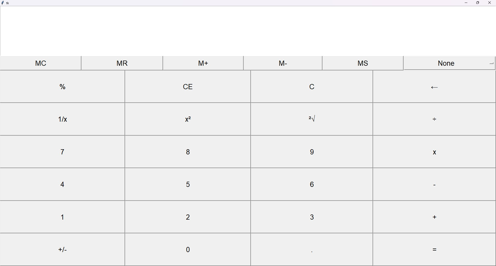

# my calculator project

This is a simple calculator application built using **Tkinter** in Python. It allows you to perform basic arithmetic operations, memory functions, and more.

here is how it looks like : 


you can download the executable in the release 
https://github.com/Phymos/calculator/releases/tag/v1.0

here is how to install from source : 
step 1
Clone the repository:
   ```bash
   git clone https://github.com/yourusername/your-repository.git

step 2
Navigate into the project directory:
cd your-repository

step 3
Install required dependencies:
pip install -r requirements.txt

step 4
Run the project:
python main.py
